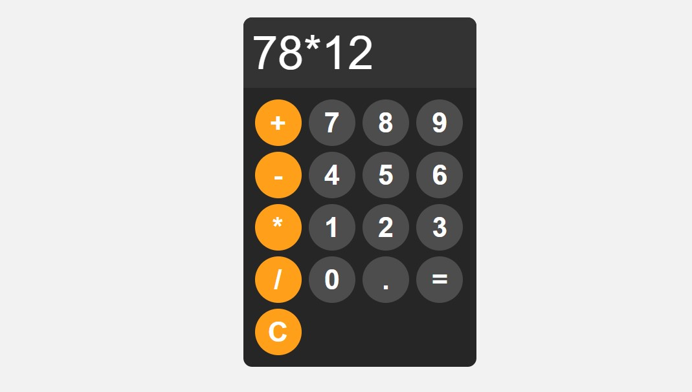

# Calculator Program

This is a solution to the [Calculator Program].

## Table of contents

- [Overview](#overview)
  - [The challenge](#the-challenge)
  - [Screenshot](#screenshot)
  - [Links](#links)
- [My process](#my-process)
  - [Built with](#built-with)
  - [What I learned](#what-i-learned)
  - [Continued development](#continued-development)
- [Author](#author)

## Overview

### The challenge

Users should be able to:

- Create a working calculator program

### Screenshot



### Links

- Solution URL: [GitHub URL](https://github.com/donttouchtomi/Calculator-Program.git)
- Live Site URL: [Netlify URL](https://stalwart-granita-5bbaad.netlify.app/)

## My process

### Built with

- Semantic HTML5 markup
- CSS custom properties
- Flexbox
- Javascript

### What I learned

Over the course creating this webpage i learned how to use the try and catch operation in javascript

```Javascript
function calculate() {
  try {
    display.value = eval(display.value);
  } catch (error) {
    display.value = "Error";
  }
}
```

### Continued development

I want to learn how to properly use the arithemtic operations in javascript...

## Author

- GitHub - [donttouch_tomi](https://github.com/donttouchtomi)
- Twitter - [@donttouch_tomi](https://www.twitter.com/donttouch_tomi)
